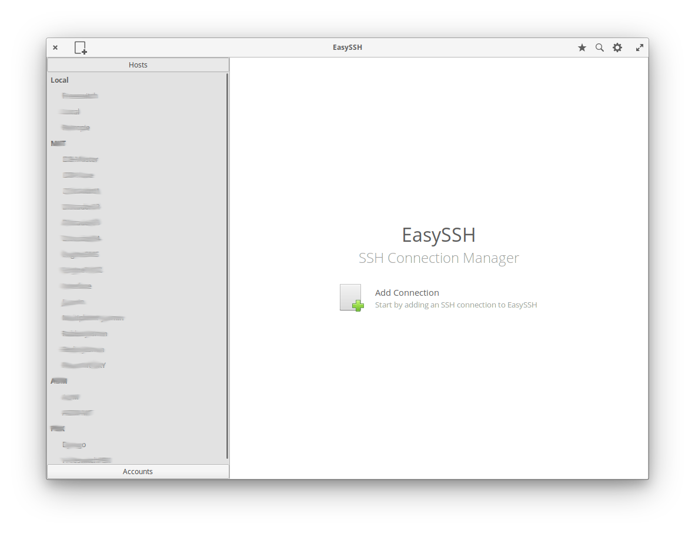
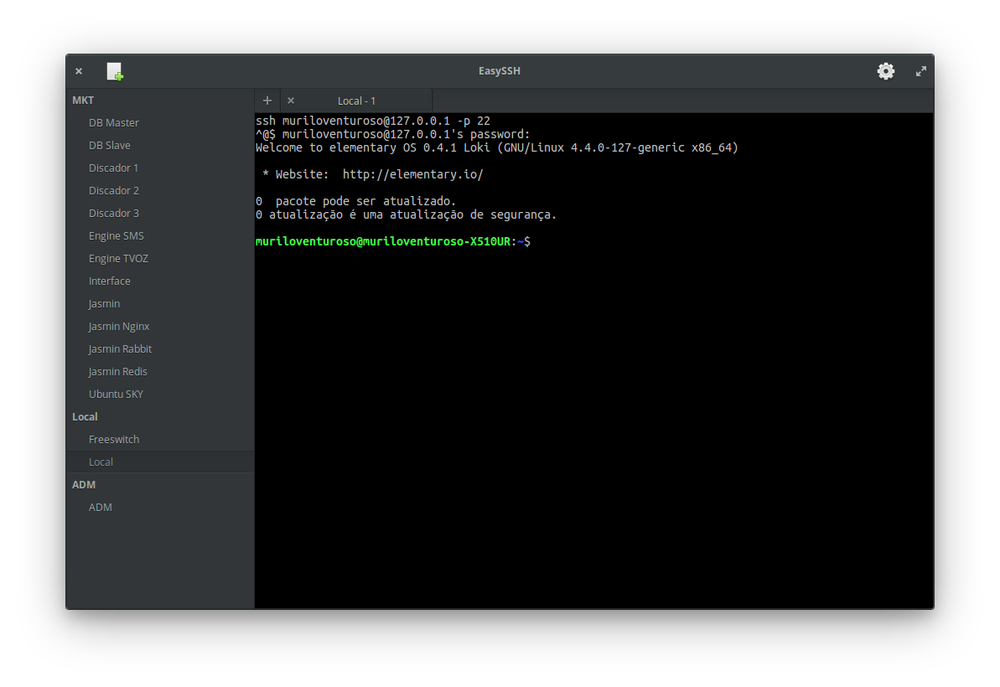

<h1 align="center">EasySSH</h1>

## The SSH connection manager to make your life easier.

A complete, efficient and easy-to-use manager. Create and edit connections, groups, customize the terminal, with multiple instances of the same connection.

  

### Features

* Manage connections and groups
* Customize terminal
* Dark Theme
* Multiple instances of same connection
* Restore opened hosts
* Sync `~/.ssh/config`
* Protect data with password

### Donate
<a href="https://www.paypal.me/muriloventuroso">PayPal</a> | <a href="https://www.patreon.com/muriloventuroso">Patreon</a>

## Developing and Building

If you want to hack on and build EasySSH yourself, you'll need the following dependencies:

* libgee-0.8-dev
* libgtk-3-dev
* libgranite-dev
* libvte-2.91-dev
* libjson-glib-dev
* libunity-dev
* meson
* valac
* gpg

Run `meson build` to configure the build environment and run `ninja test` to build and run automated tests

    meson build --prefix=/usr
    cd build
    ninja test

To install, use `ninja install`, then execute with `com.github.muriloventuroso.easyssh`

    sudo ninja install
    com.github.muriloventuroso.easyssh

## Install with Flatpak

Install:
    
    flatpak remote-add --if-not-exists flathub https://flathub.org/repo/flathub.flatpakrepo
    flatpak install flathub com.github.muriloventuroso.easyssh

Run:

    flatpak run com.github.muriloventuroso.easyssh

-----

